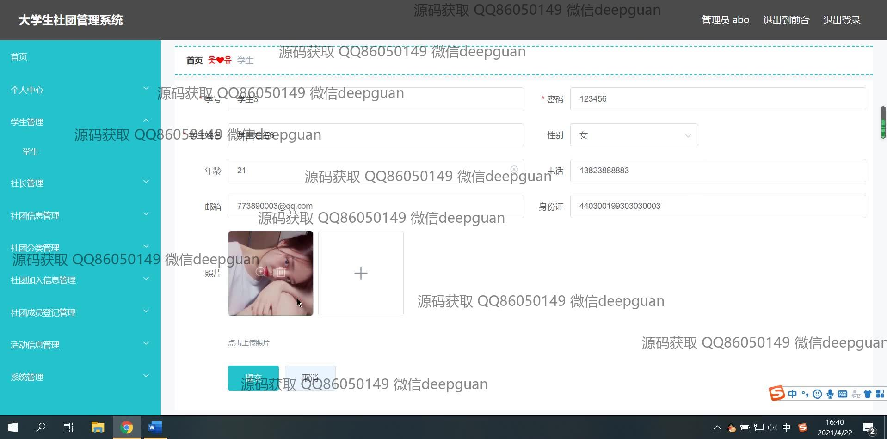

<h1 align="center">基于vue的大学生社团管理系统的设计与实现</h1>

## 简介
大学生社团管理系统：角色分为管理员、社长；功能包括学生管理、社团信息管理、活动信息管理、成员登记管理，支持用户信息修改、社团活动组织与审核。    --计算机毕业设计源码；毕设源码；java毕业设计源码

## 联系方式

<h3 align="center">获取完整代码与数据库文件 + 微信：deepguan QQ: 86050149 QQ群: 783742310</h3>

<h3 align="center">可帮忙远程部署 包运行成功！提供远程部署、修改代码、设计文档指导、代码讲解等服务！</h3>

## 功能介绍（完整见运行截图）
管理员： 登录系统以管理社团，查看和审核社团申请，管理社长及学生信息，编辑和更新社团信息，处理社团成员登记及活动信息，支持新增、修改、删除社团和成员记录，切换前后台界面，维护系统数据的标准化。查看网站首页，管理网站导航栏及社团信息的展示。通过活动信息管理模块，编辑活动详情并进行社团活动的组织与发布。

社长： 登录或注册社长账号，管理个人社团，包括输入社长信息如姓名、联系方式及性别等基本信息，编辑和修改社团简介和活动详情，通过社团信息管理，处理社团成员登记及查看社团活动和信息，支持照片上传，观察社团的注册与成员申请，发布活动，改进社团展示。通过个人中心查看及更新个人信息，并切换用户角色。

学生： 注册或登录后填写个人及社团相关信息，浏览社团信息及活动，申请加入心仪社团，查看社团详情及社团分类，通过个人中心更新个人信息，参与社团活动管理，进行信息查看和简易管理操作，利用搜索功能查找社团或活动，参与社团互动，通过评论、赞踩功能进行社交互动。

## 运行截图

本代码来源于网络,仅供学习参考使用!

